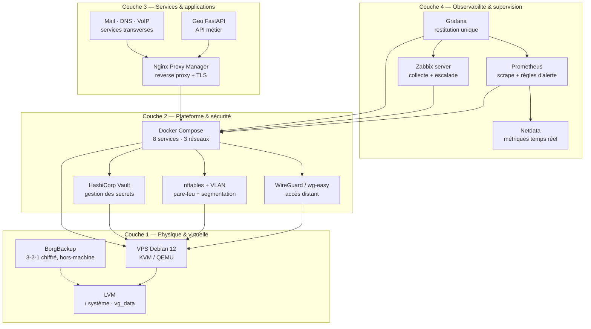

# Infrastructure as Code — Production Homelab / Multi-Site

[](https://github.com/kohiodevp/infra-as-code/actions/workflows/ci.yml)
[](./LICENSE)
[](./README.md)

Dépôt d'infrastructure **déclarative, versionnée et vérifiée en CI** pour une
production 24/7 : provisioning Ansible, plateforme Docker Compose segmentée,
sauvegarde chiffrée 3-2-1, supervision multicouche et scripts d'exploitation
validés par `shellcheck`.

| Champ | Valeur |
| --- | --- |
| **Auteur** | [Zounoumité KOHIO](mailto:zounoumitek@gmail.com) — [zounoumitek@gmail.com](mailto:zounoumitek@gmail.com) |
| **Contexte** | Infra production 24/7 · Debian 12 · KVM/QEMU · Docker Compose · WireGuard · Ansible · Zabbix · BorgBackup |
| **Licence** | MIT — voir [`LICENSE`](./LICENSE) |
| **Qualité** | `ansible-lint` (profil `production`) · `shellcheck --severity=style` · `docker compose config` |
| **Statut** | v1.0.0 — plateforme déployable, orchestration Ansible en cours (voir [§6](#6-documentation--feuille-de-route)) |

---

## Sommaire

1. [Architecture à 4 couches](#1-architecture-à-4-couches)
2. [Déploiement rapide](#2-déploiement-rapide)
3. [Tableau des services](#3-tableau-des-services)
4. [Sécurité, PRA & observabilité](#4-sécurité-pra--observabilité)
5. [Validation continue (CI)](#5-validation-continue-ci)
6. [Documentation & feuille de route](#6-documentation--feuille-de-route)

---

## 1. Architecture à 4 couches

Le modèle mental du dépôt est décrit en détail dans
[`docs/ARCHITECTURE.md`](./docs/ARCHITECTURE.md). Règle de lecture : **une couche
ne consomme que les services de la couche inférieure**, et aucune couche ne
contourne celle du dessous (une application n'accède jamais directement au disque
sans passer par la plateforme).



**Frontière de confiance** (couche 2) — trois réseaux Compose, aucun pont unique :

```text
Internet ──► nftables ──► edge ──► backend ──► data
  (22/80/443,   (filtre)   (NPM,     (services)   (PostgreSQL,
   51820/UDP)              WG,                    internal: true)
                           Grafana…)
```

| Réseau | Rôle | Ports publiés |
| --- | --- | --- |
| `edge` | Seule zone exposée publiquement | 80, 443, 51820/UDP |
| `backend` | Bus inter-services | aucun |
| `data` | Données, **aucune sortie Internet** (`internal: true`) | aucun |

---

## 2. Déploiement rapide

Prérequis : Debian 12 (ou Ubuntu 24.04), Docker ≥ 24 + Compose v2, Ansible ≥ 2.16,
`shellcheck` pour le lint local.

```bash
# 1. Récupérer le dépôt
git clone <url-du-depot> infra-as-code
cd infra-as-code

# 2. Configurer l'environnement — aucun secret n'est versionné
cp .env.example .env
openssl rand -hex 24                 # POSTGRES_PASSWORD, GRAFANA_ADMIN_PASSWORD, ...
docker run --rm ghcr.io/wg-easy/wg-easy:14 wgpw '<mot-de-passe>'   # WIREGUARD_PASSWORD_HASH

# 3. Valider la configuration avant tout démarrage (étape de la CI)
docker compose config -q

# 4. Provisionner l'hôte (Ansible)
ansible-playbook -i ansible/inventories/production ansible/site.yml

# 5. Monter la plateforme
docker compose up -d

# 6. Contrôler l'état du système (charge, disque, inodes, conteneurs, VPN, ports)
./scripts/healthcheck_all.sh
```

Sorties possibles du healthcheck : `0` OK, `1` avertissement, `2` critique —
prêt à être branché sur un cron ou sur Zabbix.

Variables d'environnement principales (liste complète et commentée dans
[`.env.example`](./.env.example)) : `POSTGRES_*`, `ZABBIX_*`, `GRAFANA_*`,
`PROMETHEUS_*`, `NETDATA_*`, `WIREGUARD_*`, `VAULT_*`, `HTTP(S)_*`.

> **État de l'étape 4** : l'inventaire et les 6 rôles (`common`, `docker`,
> `security`, `vpn`, `backup`, `monitoring`) sont scaffoldés dans `ansible/`,
> `ansible/site.yml` est le point d'entrée prévu ; la rédaction des rôles est la
> prochaine étape de la feuille de route. Les étapes 1, 2, 3, 5 et 6 sont
> opérationnelles et testées.

---

## 3. Tableau des services

Les 8 services de [`docker-compose.yml`](./docker-compose.yml), tags d'images
figés pour un déploiement reproductible (ADR-005).

| Service | Image | Rôle | Ports hôte | Réseau(x) |
| --- | --- | --- | --- | --- |
| `nginx-proxy-manager` | `jc21/nginx-proxy-manager:2.16.0` | Reverse proxy, termination TLS, certs Let's Encrypt | `80`, `443` publics — `81` admin en loopback | `edge`, `backend` |
| `zabbix-server` | `zabbix/zabbix-server-pgsql:7.0.31-alpine` | Collecte agent/SNMP, déclencheurs, escalade, historique | `10051` loopback | `backend`, `data` |
| `grafana` | `grafana/grafana:11.6.16` | Portail de restitution (UI unique pour les métriques) | `3000` loopback | `edge`, `backend`, `data` |
| `prometheus` | `prom/prometheus:v3.15.0` | Scraping, agrégation, règles d'alerte, rétention | `9090` loopback | `edge`, `backend` |
| `netdata` | `netdata/netdata:v2.12.0` | Métriques temps réel (hôte, process, conteneurs) | `19999` loopback | `edge`, `backend` |
| `wireguard` | `ghcr.io/wg-easy/wg-easy:14` | VPN d'accès distant au réseau interne + UI | `51820/UDP` public — `51821` UI en loopback | `edge` |
| `vault` | `hashicorp/vault:1.19.5` | Maîtrise des secrets applicatifs (serveur réel, non `-dev`) | `8200` loopback | `edge` |
| `postgres` | `postgres:16-alpine` | Données : bases et comptes dédiés par application | aucun (zone `data` uniquement) | `data` |

Points remarquables :

- **Toutes les UI d'administration sont en loopback** (`127.0.0.1`) : accès par
  tunnel SSH ou depuis le réseau WireGuard, jamais par porte ouverte (ADR-002).
- Les seules entrées publiques de la machine sont **22, 80, 443, 51820/UDP**.
- Une seule instance PostgreSQL, bases et rôles créés au premier démarrage par
  [`docker/postgres/initdb/01-init-databases.sh`](./docker/postgres/initdb/01-init-databases.sh)
  (ADR-003) : `zabbix` et `grafana` n'ont jamais le mot de passe de l'autre.
- Chaque service porte `restart: unless-stopped` et `security_opt:
  no-new-privileges` (8/8) ; healthchecks natifs sur PostgreSQL (`pg_isready`) et
  Grafana.

---

## 4. Sécurité, PRA & observabilité

### Sécurité — principes appliqués

- **Secrets** : aucun secret versionné (`.env` ignoré par Git,
  [`.env.example`](./.env.example) sans valeur réelle) ; HashiCorp Vault est en
  service pour les secrets applicatifs — auto-unseal et TLS à activer avant
  usage en production.
- **Exposition minimale** : 4 entrées publiques (22, 80, 443, 51820/UDP) et
  toutes les UI d'administration en loopback.
- **Durcissement conteneurs** : `no-new-privileges` sur les 8 services,
  `restart: unless-stopped`, healthchecks natifs sur PostgreSQL et Grafana.
- **Segmentation** : trois réseaux Compose, la zone `data` en `internal: true`
  (aucune sortie Internet pour la base).
- **Reproductibilité et CI** : tags d'images figés (ADR-005), workflow en
  `permissions: contents: read` (lecture seule), aucun déploiement déclenché par
  la CI.

### Sauvegarde — stratégie 3-2-1 (BorgBackup)

| Exigence | Cible | Moyen en place |
| --- | --- | --- |
| **3 copies** | données d'origine + 2 copies de sauvegarde | volumes Docker + dépôt Borg |
| **2 supports** | disque local + support distinct | `vg_data` + dépôt Borg hors-machine (`ssh://`) |
| **1 copie hors-site** | isolation vis-à-vis de l'hôte | dépôt distant, chiffré `repokey-blake2` |
| **RPO** | **< 4 h** | `backup_borg.sh` prêt à brancher en cron (cadence ≤ 4 h) |
| **RTO** | **< 2 h** | `borg extract` / `borg mount` — procédure [`docs/RESTAURATION.md`](./docs/RESTAURATION.md) (à rédiger) |
| **Tests** | **mensuels** | campagne de test de restauration — [`scripts/restore_test.sh`](./scripts/restore_test.sh) (à compléter) |

- Script canonique : [`scripts/backup_borg.sh`](./scripts/backup_borg.sh)
  (même script livré dans `scripts-admin/backup/borg_backup.sh`).
- Rétention appliquée : **7 archives quotidiennes, 4 hebdomadaires, 12 mensuelles**
  (`--keep-daily 7 --keep-weekly 4 --keep-monthly 12 --glob-archives <préfixe>-*`),
  puis `borg check` d'intégrité (`metadata` par défaut, `data` optionnel).
- Verrou anti-cumul, `umask 077`, secret **fourni par l'appelant**
  (`BORG_PASSPHRASE` / `BORG_PASSCOMMAND`) — jamais dans le dépôt ni dans les
  scripts.
- Une sauvegarde n'est réputée valide que si un **test de restauration** a réussi.

### Réseau — VPN auto-healing (WireGuard watchdog)

[`scripts/wg_watchdog.sh`](./scripts/wg_watchdog.sh) est prévu en cron
(`* * * * *`, une exécution par minute) :

1. ping de la passerelle du tunnel (déduite des routes de l'interface si
   `WG_PING_TARGET` est vide) ;
2. compteur d'**échecs consécutifs** persistant et atomique (fichier d'état +
   `flock`) — il survit à un redémarrage de la machine ;
3. au-delà de `WG_MAX_FAILURES` (3 par défaut), relance propre du service
   (`WG_RESTART_CMD` → `systemctl restart wg-quick@<if>` → `wg-quick down/up`) puis
   **vérification post-relance** ;
4. tout est journalisé dans le syslog (`logger`), avec codes de retour
   `0` / `1` / `2` exploitables par la supervision.

Le mode `--force` permet de forcer une relance hors seuil (usage manuel).

### Surveillance — supervision multicouche

- **Netdata** (seconde) → **Prometheus** (scrape 15 s, règles dans
  [`monitoring/prometheus.rules.yml`](./monitoring/prometheus.rules.yml)) →
  **Grafana** (restitution unique) ;
- **Zabbix** (collecte, escalade, historique long) sur base PostgreSQL dédiée ;
- invariant : le stack de supervision doit survivre à la panne de ce qu'il
  supervise (alertes `up == 0` sur les cibles elles-mêmes).

---

## 5. Validation continue (CI)

Workflow : [`.github/workflows/ci.yml`](./.github/workflows/ci.yml) — déclenché
sur `push` et `pull_request` vers `main` / `develop`, `permissions: contents: read`,
concurrence annulée sur le dernier push.

| Étape | Outil | Ce qu'elle protège |
| --- | --- | --- |
| Lint Ansible | `ansible-lint` 26.9.0, profil `production` | Cohérence et sécurité des playbooks et rôles |
| Lint shell | `shellcheck --external-sources --severity=style scripts/*.sh` | Fiabilité des scripts d'exploitation (seuil le plus strict) |
| Validation Compose | `cp .env.example .env && docker compose config --quiet` | Compose valide + `.env.example` complet (toutes variables référencées présentes) |

Reproduire localement :

```bash
ansible-lint ansible/
shellcheck --severity=style scripts/*.sh
cp .env.example .env && docker compose config -q
```

Les scripts d'exploitation ont été validés par un banc d'essai à stubs (`borg`,
`ping`, `docker`, `ip`, `wg`) et une pile Compose jetable : 130 assertions
couvrant les codes de retour `0/1/2/64`, les verrous, les seuils d'alerte, la
gestion des variables vides, le **rollback de déploiement** et le **test de
restauration** (y compris nettoyage du dossier temporaire).

> Le badge **CI** est celui du workflow réel
> [`.github/workflows/ci.yml`](./.github/workflows/ci.yml), exécuté sur `main`
> à chaque push/PR. La licence et la version restent des badges de gabarit.

---

## 6. Documentation & feuille de route

| Document | Objet | État |
| --- | --- | --- |
| [`docs/ARCHITECTURE.md`](./docs/ARCHITECTURE.md) | Modèle à 4 couches, ADR-001 à ADR-005, écarts connus | Rédigé |
| [`docs/DEPLOIEMENT.md`](./docs/DEPLOIEMENT.md) | Procédure de mise en production pas à pas | Rédigé |
| [`docs/PROCEDURES.md`](./docs/PROCEDURES.md) | Runbooks d'exploitation par alerte | Rédigé |
| [`docs/RESTAURATION.md`](./docs/RESTAURATION.md) | Procédure de restauration et de test PRA | Rédigé |
| [`docs/SECURITE.md`](./docs/SECURITE.md) | Durcissement, rotation des secrets, revue d'accès | Rédigé |
| [`docs/ARCHITECTURE.md` §7](./docs/ARCHITECTURE.md) | Écarts assumés : frontend Zabbix, Alertmanager, SMTP, nftables/VLAN/LVM | Suivi |

Prochaines étapes (dans l'ordre) :

1. Réaliser `ansible/site.yml` et les 6 rôles (inventories `production` /
   `staging` déjà en place) ;
2. ~~Rédiger les 4 documents d'exploitation restants~~ (fait : `DEPLOIEMENT`, `PROCEDURES`, `RESTAURATION`, `SECURITE`) ;
3. Ajouter `zabbix-web-nginx-pgsql` (frontend + API Grafana) et Alertmanager ;
4. Brancher `backup_borg.sh` et `wg_watchdog.sh` sur cron avec alerting Zabbix ;
5. Activer auto-unseal et TLS sur Vault avant d'y placer des secrets de production.

---

## Licence

Distribué sous licence [MIT](./LICENSE).

**Zounoumité KOHIO** — [zounoumitek@gmail.com](mailto:zounoumitek@gmail.com)
